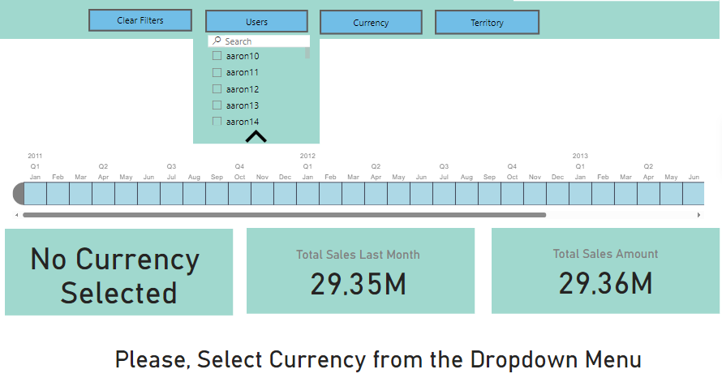
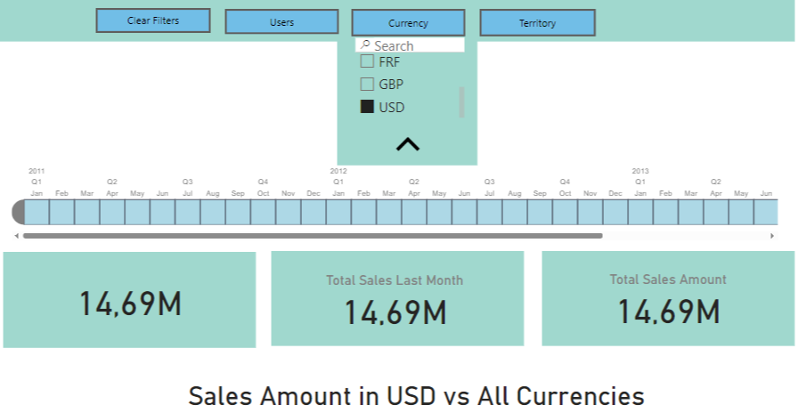
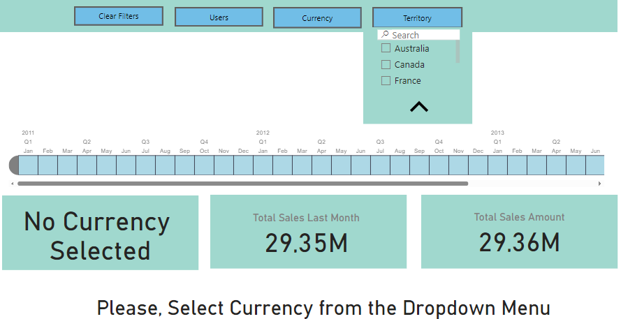
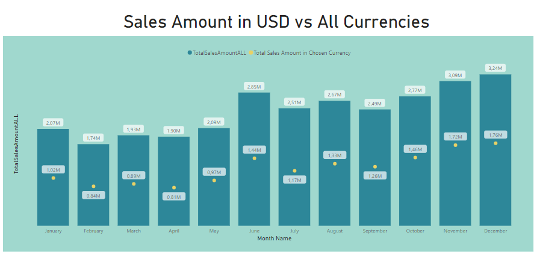
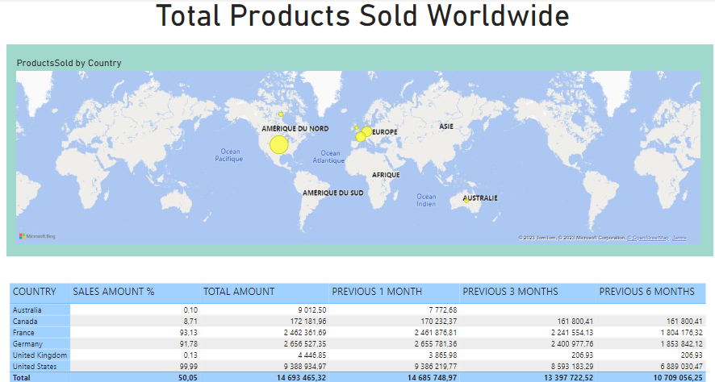

# PowerBi_SalesDashboard
## Overview

Welcome to the Power BI Sales Dashboard repository! This project offers a dynamic analytics solution for in-depth sales data analysis. Explore monthly trends, compare sales in different currencies, and visualize city-level sales data. The dashboard allows dynamic filtering by users, currency, and territory for a personalized analytics experience.

## Measures Documentation

In order to understand the calculations and metrics used in this project, please refer to the `Measures.docx` file. This Word document provides detailed documentation for each measure implemented in the Power BI dashboard.

## Dashboard Preview

Explore a glimpse of the Power BI sales dashboard below:

